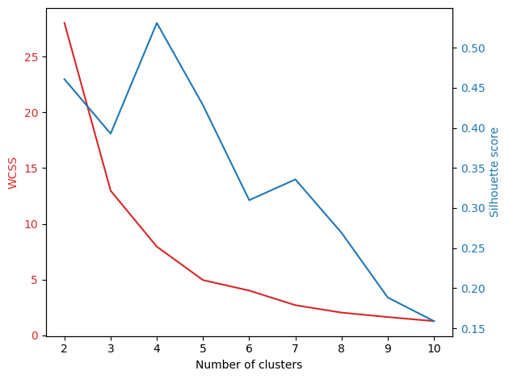

App that will cluster text into topics and summarize the contents using LLMs.

WIP.

# Intro
**Process**

1. Download text data from reddit. Look at `soc_api.py` and `test.ipynb` .
2. Generate TFIDF, LDA, NMF and embedding features for clustering.
3. Cluster documents into 2 to 10 clusters. Use elbow method and silhouette score to determine optimal number of clusters.
    - Determine optimal features for topic modeling (TFIDF,LDA,NMF,Embeddings).
4. Use LLM to summarize clusters using `langchain` .
    - Limititaions: context window is ~4k tokens.

# Clustering

Look at `optimized-kmeans-clustering.ipynb` .

**KMeans Clustering of TFIDF Features**

**Elbow method and silhouette scores**
